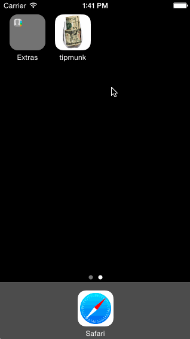

# Tip Caculator

This is a tip calculator created for the CodePath pre-work. It follows the following video: http://vimeo.com/102084767 as well as additional instructions at https://gist.github.com/timothy1ee/6858b706304a2397a7e2.

Time spent: 6 hours

Completed user stories:

 * [x] Required: Create the tip calculator
 * [x] Required: Design settings page
 * [x] Required: Loading and saving settings
 * [x] Required: Utilize view controller lifecycle
 * [x] Required: Create and configure segue
 * [x] Required: Use animation in the UI
 * [x] Optional: Clear settings after app has been in the background for a given amount of time
 
Notes:

I decided to use a uislider to control the tip rather than a segmented control.
A good bit of time was spent on testing out different things without auto layouts and constraints. That's definitely an area I want to dig into a lot more.

GIF created with [LiceCap](http://www.cockos.com/licecap/).
